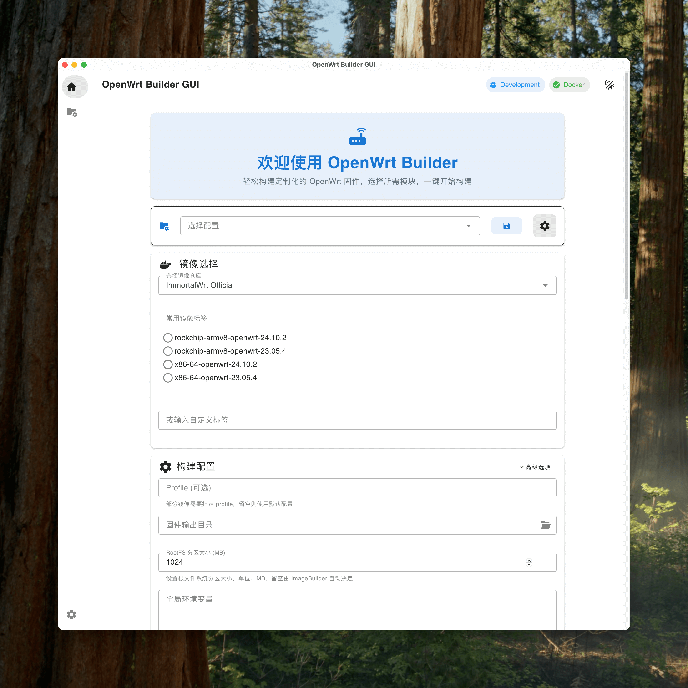
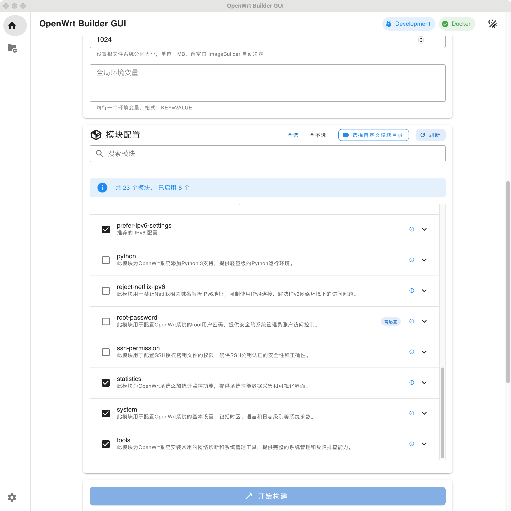

<div align="center">

# OpenWrt Builder

English | [简体中文](README.md)

Build your customized OpenWrt firmware with ease

GUI + CLI for a simpler, faster firmware build experience

[](https://github.com/EkkoG/OpenWrt/releases/tag/alpha)
[](LICENSE)
[](https://github.com/EkkoG/OpenWrt/stargazers)

</div>

---

## Features at a glance

- **Ready to use**: Based on official ImageBuilder, build in minutes
- **Modular**: Built‑in common modules, supports custom module directory
- **One‑click build**: GUI or script commands with real‑time logs and progress
- **Containerized**: Docker‑isolated build environment; no toolchain setup required
- **Reusable configs**: Multiple build presets; environment variables centrally managed

## UI Preview

<div align="center">
<table>
<tr>
<td></td>
<td></td>
</tr>
</table>
</div>

---

## Download & Install (GUI)

- Download prebuilt installers from the releases page: [Releases](https://github.com/EkkoG/OpenWrt/releases)

| Platform | Package | Notes |
|------|-----------|------|
| macOS | `.dmg` | Apple Silicon choose `aarch64`, Intel choose `x86_64` |
| Windows | `.msi` / `.exe` | Windows 10/11 |
| Linux | `.deb` / `.AppImage` | Ubuntu 20.04+ and other major distros |

Alternatively build from source: see “Development & Build” below.

Note: Please install and start Docker before using the GUI to build firmware.

---

## Quick Start

### Method 1: Graphical UI (Recommended)

**Installation steps:**

0) Install and start Docker (required)
   - **Linux**: `sudo apt install docker.io` or `sudo pacman -S docker`
   - **macOS/Windows**: Install Docker Desktop

1) Download and install OpenWrt Builder
   - **Linux (.deb)**: `sudo dpkg -i openwrt-builder_*.deb`
   - **Linux (.AppImage)**: `chmod +x OpenWrt-Builder-*.AppImage`
   - **macOS**: Open the .dmg and drag to Applications
   - **Windows**: Run the .msi installer

2) Choose image (OpenWrt/ImmortalWrt) and target platform/version
3) On the “Modules” page, select the modules you need
4) Optional: Set output directory, mirror acceleration, etc.
5) One‑click build in “Build Center” and wait for completion

Tip: The first build downloads more resources; subsequent builds are much faster.

### Method 2: Command Line (Advanced)

**Linux/macOS:**
From repository root, use `run.sh`:

```bash
# Help
./run.sh --help

# Minimal example (ImmortalWrt Rockchip)
./run.sh \
  --image=immortalwrt/imagebuilder:rockchip-armv8-openwrt-23.05.1 \
  --profile=friendlyarm_nanopi-r2s \
  --with-pull --rm-first --use-mirror
```

**Windows:**
From repository root, in PowerShell run `run.ps1`:

```powershell
# Help
.\run.ps1 -Help

# Minimal example (ImmortalWrt Rockchip)
.\run.ps1 `
  -Image "immortalwrt/imagebuilder:rockchip-armv8-openwrt-23.05.1" `
  -Profile "friendlyarm_nanopi-r2s" `
  -WithPull -RmFirst -UseMirror
```

**Common options:**

Linux/macOS (Bash):
```bash
--image=...          ImageBuilder image (required)
--profile=...        Device profile (optional)
--output=...         Output directory (default: ./bin)
--custom-modules=... Custom modules directory (default: ./custom_modules)
--with-pull          Pull image before build
--rm-first           Clean container before build
--use-mirror         Use mirror acceleration (enabled by default)
--mirror=...         Mirror domain, e.g. mirrors.pku.edu.cn
```

Windows (PowerShell):
```powershell
-Image "..."         ImageBuilder image (required)
-Profile "..."       Device profile (optional)
-Output "..."        Output directory (default: ./bin)
-CustomModules "..." Custom modules directory (default: ./custom_modules)
-WithPull            Pull image before build
-RmFirst             Clean container before build
-UseMirror           Use mirror acceleration (enabled by default)
-Mirror "..."        Mirror domain, e.g. mirrors.pku.edu.cn
```

Environment variables (`.env`) example:

```bash
# Adjust relative to default module set
MODULES="openclash lan pppoe -tools"

# Or fully override the default module set (higher priority)
ENABLE_MODULES="argon base lan"

# System env vars are enabled by default; modules can reference variables defined in root .env

# Common ImageBuilder parameters
CONFIG_TARGET_KERNEL_PARTSIZE=32
CONFIG_TARGET_ROOTFS_PARTSIZE=256
```

Default output directory is `./bin`; override with `--output`.

---

## Module System (Brief)

- **Default module set**: `add-all-device-to-lan argon base opkg-mirror prefer-ipv6-settings statistics system tools`
- Two selection methods:
  - **ENABLE_MODULES**: Fully replace the enabled module list
  - **MODULES**: Add/remove on top of the default set (`-` prefix to exclude)
- Module locations: supports both `modules/` (built‑in) and `custom_modules/` (user)
- Directory structure:

```
my-module/
├─ packages            # Dependency packages (space‑separated list or executable script)
├─ files/              # Files to include in the firmware
├─ post-files.sh       # Optional: post‑processing after files copy
├─ .env                # Optional: module‑level variables
└─ README.md           # Optional: module description
```

Advanced features:
- Env var sharing: modules can reference variables from root `.env` (enabled by default)
- Variable substitution: files under `files/etc/uci-defaults` support `$VARNAME` replacement
- Conflict protection: build fails if multiple modules generate the same target path (to prevent overwrite)

---

## FAQ

**General:**
- Slow build/limited bandwidth? Enable `--use-mirror` or specify `--mirror=mirrors.pku.edu.cn`
- Docker not installed? Install Docker Desktop (macOS/Windows) or Docker Engine (Linux)
- Where are outputs? Default `./bin` (change with `--output`)
- GUI build fails/unresponsive? Ensure Docker is installed and running; running from source also requires Node.js 18+ and pnpm 8+. See “Development & Build”.

**Windows specific:**
- PowerShell scripts won’t run? Execute `Set-ExecutionPolicy -ExecutionPolicy RemoteSigned -Scope CurrentUser`
- Docker not found? Ensure Docker Desktop is installed and running; try restarting the terminal
- Permission issues? Run PowerShell or Docker Desktop as Administrator
- Non‑ASCII path issues? Prefer checking out the repo into an ASCII‑only path

**Linux specific:**
- AppImage won’t start? `sudo apt install fuse` to install FUSE support
- No Docker permission? Add your user to the docker group: `sudo usermod -aG docker $USER`, then re‑login
- .deb installation failed? `sudo apt-get install -f` to fix dependencies
- GUI won’t launch? Ensure required desktop and system libraries are installed

---

## Development & Build

Directory layout:

```
.
├─ build.sh                 # Actual build script inside container (cross‑platform)
├─ run.sh                   # Linux/macOS build script (Docker Compose)
├─ run.ps1                  # Windows PowerShell build script
├─ modules/                 # Built‑in module library
├─ custom_modules/          # Put your custom modules here
├─ setup/                   # Pre‑build setup scripts
├─ tauri-app/               # GUI app (Tauri 2 + Vue 3)
└─ LICENSE                  # MIT license
```

**Run GUI from source and package:**

```bash
cd tauri-app
pnpm install

# Development (Tauri dev, fixed port 1420)
pnpm tauri dev

# Production packaging (desktop installers)
pnpm tauri build
```

**Platform specific requirements:**

*Windows:*
- Install Rust toolchain (with MSVC)
- Install Visual Studio Build Tools or Visual Studio
- Ensure PowerShell 5.1+ or PowerShell Core 7+

*Linux:*
- Build tools: `sudo apt install build-essential`
- GTK libs: `sudo apt install libgtk-3-dev libwebkit2gtk-4.1-dev`
- Others: `sudo apt install libappindicator3-dev librsvg2-dev patchelf`

*macOS:*
- Install Xcode Command Line Tools: `xcode-select --install`

Note: Packaging bundles root `build.sh`, `run.sh`, `run.ps1`, `setup/`, `modules/` as resources. Platform‑specific installers (.dmg/.msi/.deb/.AppImage) will be generated.

---

## Contributing

- **Bug reports**: [Open an Issue](https://github.com/EkkoG/OpenWrt/issues)
- **Feature requests**: [Request feature](https://github.com/EkkoG/OpenWrt/issues/new)
- **Code contributions**: [Submit a Pull Request](https://github.com/EkkoG/OpenWrt/pulls)
- **Docs improvements**: Help improve README and Wiki
- **Module sharing**: Share your custom modules

## Acknowledgements

<div align="center">

### Core
[**OpenWrt**](https://openwrt.org/) • [**ImmortalWrt**](http://immortalwrt.org/) • [**Docker**](https://www.docker.com/)

### Networking
[**OpenClash**](https://github.com/vernesong/OpenClash) • [**dae**](https://github.com/daeuniverse/dae) • [**Passwall**](https://github.com/xiaorouji/openwrt-passwall)

### Frameworks
[**Tauri**](https://tauri.app/) • [**Vue.js**](https://vuejs.org/) • [**Vuetify**](https://vuetifyjs.com/)

</div>

## License

Released under the MIT License. See `LICENSE`.

---

<div align="center">

[](https://star-history.com/#EkkoG/OpenWrt&Date)

</div>
