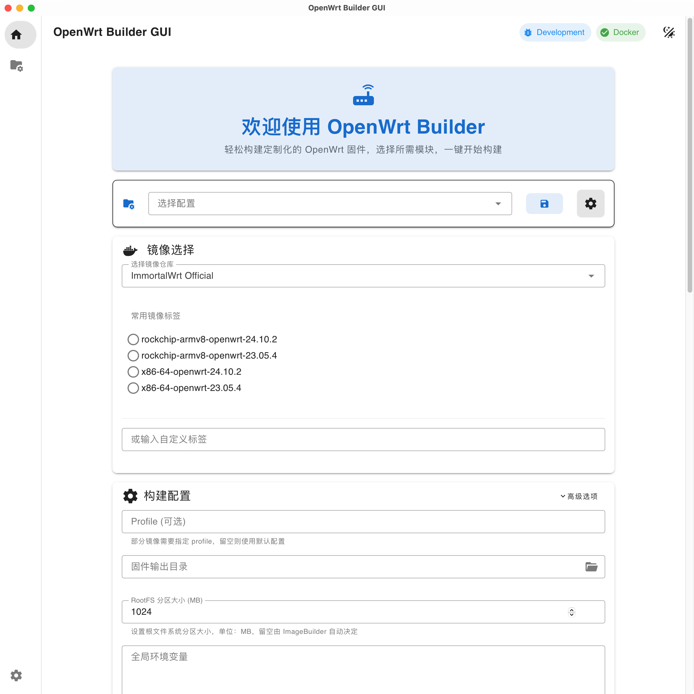

<div align="center">

# 🚀 OpenWrt Builder

**轻松定制您专属的 OpenWrt 固件**

*支持图形界面和命令行，让固件构建变得简单高效*

[](https://github.com/EkkoG/OpenWrt/releases)
[](LICENSE)
[](https://github.com/EkkoG/OpenWrt/stargazers)

</div>

---

## ✨ 为什么选择 OpenWrt Builder？

告别繁琐的固件编译过程！OpenWrt Builder 让您能够：

🎯 **开箱即用** - 无需复杂配置，刷机后直接使用  
⚡ **快速构建** - 基于官方 ImageBuilder，数分钟完成构建  
🛠️ **模块化** - 丰富的内置模块 + 自定义扩展支持  
💾 **配置持久化** - 保存多套配置方案，告别重复工作  
🖥️ **双模式** - 图形界面 + 命令行，满足不同用户需求

### 🔥 核心优势

相比官方 Firmware Selector 和传统编译方式：
- ✅ 支持自定义软件源和模块扩展
- ✅ 预配置网络参数，刷机后免配置上网
- ✅ 集成主流代理软件的最佳实践
- ✅ Docker 容器化，环境隔离更安全
- ✅ 可视化操作界面，降低使用门槛

## 📱 界面预览

<div align="center">

### 🎨 现代化图形界面

*简洁美观的设计，强大易用的功能*




</div>

**✨ 主要功能模块：**

| 功能模块 | 描述 | 亮点 |
|---------|------|------|
| 🏠 **欢迎界面** | 项目介绍与快速上手 | 新手友好的引导体验 |
| 📦 **镜像管理** | 支持 OpenWrt/ImmortalWrt 多版本 | 一键切换，自动适配 |
| 🧩 **模块配置** | 可视化模块选择和配置 | 内置+自定义双重支持 |
| ⚡ **构建中心** | 一键构建，实时日志监控 | 支持取消，进度可视化 |
| 💾 **配置管理** | 多方案保存与快速切换 | 团队协作，经验复用 |

## 🛠️ 核心特性

<table>
<tr>
<td width="50%">

### 🔧 **智能模块系统**
- 🧩 丰富的内置模块库
- 🎛️ 一键启用/禁用模块
- 📁 支持自定义模块目录
- 🔍 智能搜索和分类

### 🌐 **网络配置优化**
- 🌍 预配置代理软件 (OpenClash, daed, etc.)
- 🔌 自动配置 LAN/PPPoE 参数
- 📡 优化 IPv6 设置
- 🚀 开机即用，无需手动配置

</td>
<td width="50%">

### ⚡ **高效构建流程**
- 🐳 Docker 容器化构建
- ⏱️ 数分钟完成固件生成
- 📊 实时构建进度和日志
- 🔄 支持构建过程中断和恢复

### 💾 **配置管理**
- 📋 多套配置方案保存
- 🔄 一键切换构建目标
- 👥 团队配置共享
- 🔒 配置加密和备份

</td>
</tr>
</table>

---

## 🚀 快速开始

### 📥 方式一：图形界面 (推荐新手)

<div align="center">

#### 📦 下载安装包

从 [**Releases**](https://github.com/EkkoG/OpenWrt/releases) 获取最新版本

| 平台 | 下载链接 | 说明 |
|------|---------|------|
| 🍎 **macOS** | `.dmg` | M1/M2 选择 `aarch64`，Intel 选择 `x86_64` |
| 🪟 **Windows** | `.msi` | *即将发布* |
| 🐧 **Linux** | `.AppImage` | *即将发布* |

</div>

**✨ 使用步骤：**

1. 📥 下载并安装对应平台的应用
2. 🚀 启动应用，查看欢迎界面
3. 🎯 选择 OpenWrt/ImmortalWrt 镜像版本
4. 🧩 配置所需模块和参数
5. ⚡ 点击构建，等待完成

### ⌨️ 方式二：命令行 (推荐进阶用户)

**📋 环境准备：**
```bash
# 安装 Docker
curl -fsSL https://get.docker.com | bash

# 克隆项目
git clone https://github.com/EkkoG/OpenWrt.git
cd OpenWrt
```

**🔧 命令行参数：**
```bash
./run.sh --help

# 核心参数
--image          指定 ImageBuilder 镜像 (必需)
--profile        指定设备 Profile
--output         指定输出目录 (默认: ./bin)
--user-modules   指定自定义模块目录

# 构建选项
--with-pull      构建前拉取最新镜像
--rm-first       构建前清理容器
--use-mirror     使用镜像加速
--mirror         指定镜像地址 (如: mirrors.jlu.edu.cn)
```

**💡 使用示例：**

<details>
<summary>📱 基础构建示例</summary>

```bash
# NanoPi R2S 基础固件
./run.sh \
  --image=immortalwrt/imagebuilder:rockchip-armv8-openwrt-23.05.1 \
  --profile=friendlyarm_nanopi-r2s \
  --rm-first --with-pull --use-mirror
```
</details>

<details>
<summary>🔧 进阶自定义构建</summary>

```bash
# 使用自定义模块 + 指定输出目录
./run.sh \
  --image=immortalwrt/imagebuilder:rockchip-armv8-openwrt-23.05.1 \
  --profile=friendlyarm_nanopi-r2s \
  --user-modules=/path/to/custom/modules \
  --output=./my_firmware \
  --mirror=mirrors.pku.edu.cn
```
</details>

**⚙️ 环境配置：**
```bash
# 创建配置文件
cat > .env << EOF
# 模块配置
MODULES="openclash lan pppoe -tools"

# ImageBuilder 参数
CONFIG_TARGET_KERNEL_PARTSIZE=32
CONFIG_TARGET_ROOTFS_PARTSIZE=256

# 环境变量共享 (可选)
USE_SYSTEM_ENV=1
EOF
```

---

## 🧩 模块系统详解

> **模块化设计** - 所有功能通过模块实现，灵活组合，按需定制

### 📦 模块类型

<div align="center">
<table>
<tr>
<td align="center" width="50%">

### 🏠 **内置模块**
预配置的常用功能模块  
*开箱即用，最佳实践*

🌐 **网络类**: `lan`, `pppoe`, `ipv6`  
🛡️ **代理类**: `openclash`, `daed`, `passwall`  
🔧 **系统类**: `base`, `tools`, `statistics`  
📱 **主题类**: `argon`, `material`  

[📋 查看所有内置模块](https://github.com/EkkoG/OpenWrt/tree/master/modules)

</td>
<td align="center" width="50%">

### 🎨 **自定义模块**
用户自建的个性化模块  
*满足特殊需求，无限扩展*

📁 通过 GUI 选择模块目录  
⌨️ 通过 `--user-modules` 参数指定  
🔄 支持与内置模块混合使用  
👥 支持团队共享和版本管理  

[📖 模块开发指南](#模块开发)

</td>
</tr>
</table>
</div>

### 🔧 模块结构

每个模块都是一个标准化的目录，包含以下文件：

```
my-module/
├── 📄 packages        # 依赖的软件包列表 (空格分隔)
├── 📁 files/           # 系统文件 (遵循 OpenWrt files 规范)
├── 🔧 post-files.sh   # 后处理脚本 (可选)
├── ⚙️ .env             # 模块环境变量 (可选)
└── 📖 README.md        # 模块说明文档 (可选)
```

### 💡 模块使用

<details>
<summary>🎯 <strong>通过环境变量选择模块</strong></summary>

```bash
# .env 文件配置
MODULES="openclash lan pppoe argon -tools"

# 解释:
# ✅ 启用: openclash, lan, pppoe, argon
# ❌ 禁用: tools (减号前缀表示排除)
```
</details>

<details>
<summary>🔧 <strong>环境变量共享机制</strong></summary>

```bash
# 根目录 .env
USE_SYSTEM_ENV=1
CLASH_CONFIG_URL="https://example.com/config.yaml"
LAN_IP="192.168.50.1"

# 模块中可以使用这些变量
# files/etc/config/network 中: ${LAN_IP}
```
</details>

<details>
<summary>📚 <strong>模块开发示例</strong></summary>

```bash
# 创建自定义模块
mkdir -p my-modules/my-vpn

# 添加软件包依赖
echo "openvpn-openssl luci-app-openvpn" > my-modules/my-vpn/packages

# 添加配置文件
mkdir -p my-modules/my-vpn/files/etc/openvpn
cp my-config.ovpn my-modules/my-vpn/files/etc/openvpn/

# 使用模块
./run.sh --user-modules=./my-modules --image=...
```
</details>

---

## 👨‍💻 开发贡献

<div align="center">

### 🚀 **技术栈**

| 组件 | 技术 | 描述 |
|------|------|------|
| 🖥️ **GUI 前端** | Vue 3 + Vuetify | 现代化响应式界面 |
| ⚡ **GUI 后端** | Tauri + Rust | 轻量级跨平台框架 |
| 🐳 **构建引擎** | Docker + Bash | 容器化构建环境 |
| 📦 **模块系统** | Shell Scripts | 模块化配置管理 |

</div>

### 🛠️ 本地开发

<details>
<summary>🖥️ <strong>GUI 开发环境搭建</strong></summary>

```bash
# 1. 安装依赖
curl --proto '=https' --tlsv1.2 -sSf https://sh.rustup.rs | sh  # Rust
corepack enable && corepack prepare pnpm@latest --activate        # pnpm

# 2. 启动开发服务器
cd tauri-app
pnpm install
pnpm run tauri dev

# 3. 构建生产版本
pnpm run tauri build
```
</details>

<details>
<summary>🧩 <strong>模块开发规范</strong></summary>

```bash
# 模块目录结构标准
your-module/
├── packages           # 必需: 软件包依赖
├── files/             # 必需: 配置文件目录
├── post-files.sh      # 可选: 后处理脚本
├── .env              # 可选: 环境变量
├── README.md         # 推荐: 模块说明
└── .env.example      # 推荐: 环境变量示例
```
</details>

### 🤝 贡献指南

我们欢迎任何形式的贡献！

- 🐛 **Bug 报告**: [提交 Issue](https://github.com/EkkoG/OpenWrt/issues)
- 💡 **功能建议**: [功能请求](https://github.com/EkkoG/OpenWrt/issues/new)
- 🔧 **代码贡献**: [提交 Pull Request](https://github.com/EkkoG/OpenWrt/pulls)
- 📖 **文档完善**: 完善 README 和 Wiki
- 🧩 **模块分享**: 分享你的自定义模块

---

## 📚 更多资源

- 📖 [**详细文档**](https://github.com/EkkoG/OpenWrt/wiki) - 完整使用指南
- 🎯 [**默认模块列表**](https://github.com/EkkoG/OpenWrt/blob/master/build.sh) - 查看默认启用的模块
- 🧩 [**内置模块库**](https://github.com/EkkoG/OpenWrt/tree/master/modules) - 浏览所有可用模块
- 🐛 [**问题反馈**](https://github.com/EkkoG/OpenWrt/issues) - 报告 Bug 或提出建议
- 💬 [**讨论区**](https://github.com/EkkoG/OpenWrt/discussions) - 社区交流

---

## 🙏 致谢

感谢以下开源项目为本项目提供支持：

<div align="center">

### 🌟 **核心依赖**
[**OpenWrt**](https://openwrt.org/) • [**ImmortalWrt**](http://immortalwrt.org/) • [**Docker**](https://www.docker.com/)

### 🛡️ **网络工具**
[**OpenClash**](https://github.com/vernesong/OpenClash) • [**dae**](https://github.com/daeuniverse/dae) • [**Passwall**](https://github.com/xiaorouji/openwrt-passwall)

### ⚡ **技术框架**
[**Tauri**](https://tauri.app/) • [**Vue.js**](https://vuejs.org/) • [**Vuetify**](https://vuetifyjs.com/)

</div>

---

<div align="center">

### ⭐ 如果这个项目对你有帮助，请给个 Star！

[](https://star-history.com/#EkkoG/OpenWrt&Date)

**OpenWrt Builder** - 让固件定制变得简单  
*Built with ❤️ by the community*

</div>
